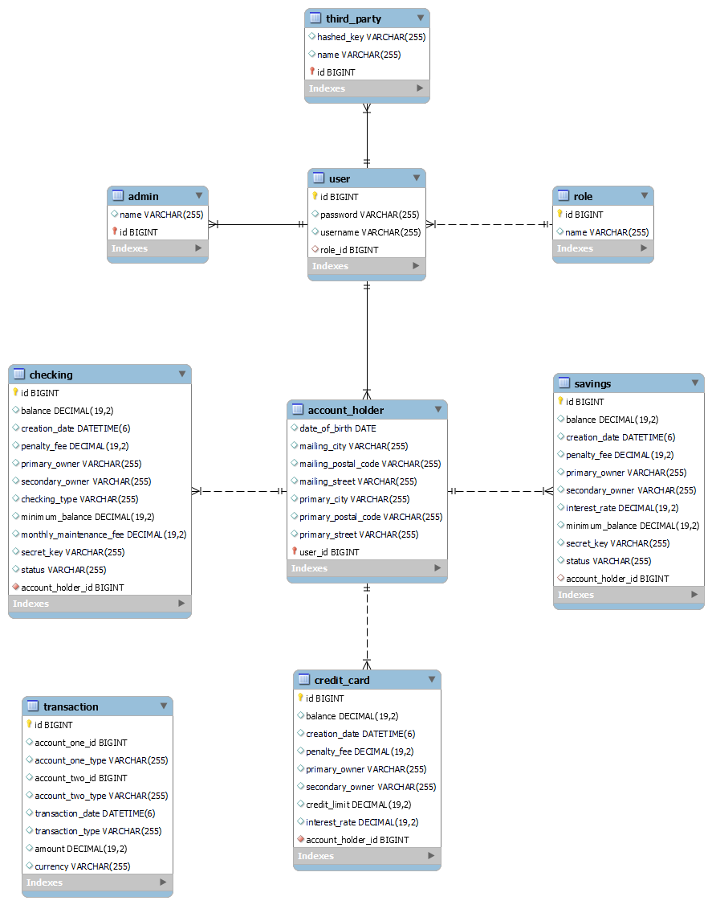

# Midterm project: Banking system
This is a banking system project which allows you to use the general basic functionalities of an online banking system.

## Getting started
1. Clone this repo to a new project in IntelliJ
2. Run the following code in your MySQL Workbench:
   ```sh
   CREATE DATABASE IF NOT EXISTS midtermProject;
   USE midtermProject;

   CREATE USER IF NOT EXISTS 'ironhacker'@'localhost' IDENTIFIED BY '1r0nh4ck3r';
   GRANT ALL PRIVILEGES ON *.* TO 'ironhacker'@'localhost';
   FLUSH PRIVILEGES;
   ```
3. Run the MidTermProjectApplication.
4. Test the routes with Postman. All routes should start with **http://localhost:8080**

## Functionality
### Admin account
Some functionalities only for users having the role "Admin". A default admin user is created when running the application.
The login data are<br>
- username: admin
- password: admin123

Admins can create new accounts, access them and modify their balance.
### Create an account
There are three types of account that can be created: Savings, credit card and checking account.
Moreover, admins can also integrate third-party accounts.

#### Create an account holder
Before being able to create any account, the account holder needs to be created in the system by the admin.<br>
To do so, run the POST-route **/create/accountholder** with the following template in the body of the request:<br>
```sh
{
"username": "<your input>",
"password": "<your input>",
"role": "ACCOUNT_HOLDER",
"dateOfBirth": "YYYY-MM-DD",
"primaryAddress": {
    "streetAddress": "<your input>",
    "city": "<your input>",
    "postalCode": "<your input>"
  },
"mailingAddress": {
    "streetAddress": "<your input>", (optional)
    "city": "<your input>", (optional)
    "postalCode": "<your input>" (optional)
  }
}
```
#### Create an account
After creating the respective account holder, an account can be created with the corresponding account holder id.
This id is given when creating a new account holder.<br>
To create a new account, run the following POST-route and include the input information in the body (for a template, see below):<br>
- **/create/savings** to create a Savings account
- **/create/creditcard** to create a Credit card account
- **/create/checking** to create a Checking account <br>
If the primary owner is younger than 24, a Student Checking account will automatically created, which means that 
the account does not have a monthly maintenance fee, nor a minimum balance.
<br><br>
One account holder can only own one account of each type (which means maximum 3 in total).
#### Template to create a savings account
```sh
{
"balance": <your input>, (optional)
"penaltyFee":  <your input>, (optional)
"primaryOwner": { 
    "name": "<your input>" 
    }, 
"secondaryOwner": { (optional)
    "name": "<your input>" 
    }, 
"accountHolder": { 
    "id": <the given id number>
    },
"secretKey": "<your input>",
"minimumBalance": <your input>, (optional)
"interestRate": <your input> (optional)
}
```
#### Template to create a credit card account 
```sh
{
"balance": <your input>, (optional)
"penaltyFee":  <your input>, (optional)
"primaryOwner": { 
    "name": "<your input>" 
    }, 
"secondaryOwner": { (optional)
    "name": "<your input>" 
    }, 
"accountHolder": { 
    "id": <the given id number>
    },
"creditLimit": <your input>, (optional)
"interestRate": <your input> (optional)
}
```

#### Template to create a checking account
```sh
{
"balance": <your input>, (optional)
"penaltyFee":  <your input>, (optional)
"primaryOwner": { 
    "name": "<your input>" 
    }, 
"secondaryOwner": { (optional)
    "name": "<your input>" 
    }, 
"accountHolder": { 
    "id": <the given id number>
    },
"minimumBalance": <your input>, (optional)
"monthlyMaintenanceFee": <your input> (optional)
}
```
#### Third-party accounts
Third-party accounts can be created by admins through the POST-route *"/create/third_party"*.<br>
This is the template for the request body:
```sh
{ 
"name": "<your input>",
"username": "<your input>",
"password": "<your input>",
"hashedKey": "<your input>",
"role": {
    "name": "THIRD_PARTY"
    }
}
```

### Get a list of accounts and transactions
In order to get a list of all the accounts and transactions (only available for admins),
use the GET-route:<br>
- /savings
- /creditcard
- /checking
- /third_party
- /transactions

### Get information on specific accounts and transactions
In order to get information on specific accounts and transactions,
use the GET-route:<br>
- /savings/{id}
- /creditcard/{id}
- /checking/{id}
- /third_party/{id}
- /transactions/{id}
### Modify the balance of accounts
In order to modify the balance of specific accounts (only available for admins),
use the PATCH-route:<br>
- modify/savings/{id}
- modify/creditcard/{id}
- modify/checking/{id} <br>
The body only needs to include the information 
```sh
{
"balance": <your input>
}
```
### Transfer money for account holders
If an account holder wants to transfer money, (s)he must fill in the login data in the authorization fields
and use the PATCH-route:<br>
- /transfer/{accountType}/{value}/{owner}/{id}
### Transfer money for third parties
If a third party account holder wants to transfer money, (s)he must fill in the login data in the authorization fields,
add the hashed key in the header (with "hashedKey") and use the PATCH-route:<br>
- /transfer/third_party <br>

with the parameter:<br>
- value
- id
- secretKey *(of the account recipient, which is null when sending to another third party account)*
### Interest rate
Interest rate will be added - if applicable - through the PATCH-route:<br>
- /savings/interest/{id}
- /creditcard/interest/{id}<br>
#### Other information
- If an account drops below the minimumBalance, the penaltyFee will be deducted from the balance automatically.
- The application recognizes patterns that indicate fraud and freezes the account status when potential fraud is detected.

### Database diagram



